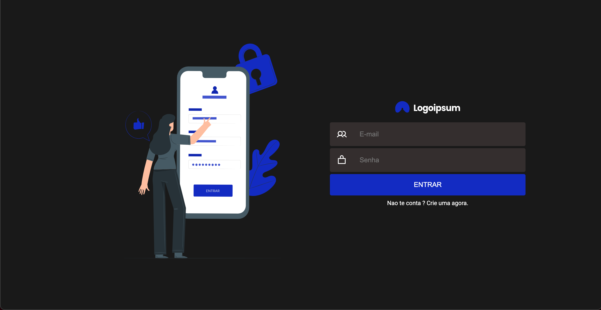

# Sistema de Chamado 
## O projeto tem como proposito criar um projeto de chamado simples com integração com o firebase

<h1 align="center">
  
</h1>

### Features
- [x] Login de usuário
- [x] Cadastro de usuário
- [x] Editar perfil de usuário
- [x] Cadastro de cliente
- [x] Cadastro de chamados
- [ ] Modal de Detalhes de chamado
- [ ] Edição de chamado 

### Pré-requisitos

Antes de começar, você vai precisar ter instalado em sua máquina as seguintes ferramentas:
[Git](https://git-scm.com), [Node.js](https://nodejs.org/en/). 
Além disto é bom ter um editor para trabalhar com o código como [VSCode](https://code.visualstudio.com/)

### 🎲 Rodando o Projeto (frontend)

```bash
# Clone este repositório
$ git clone <https://github.com/gblnovaes/sistema-de-chamados>

# Acesse a pasta do projeto no terminal/cmd
$ cd sistema-de-chamados

# Instale as dependências
$ yarn 

# Execute a aplicação em modo de desenvolvimento
$ yarn start

# O serviço inciará na porta:3000 - acesse <http://localhost:3000>

```
